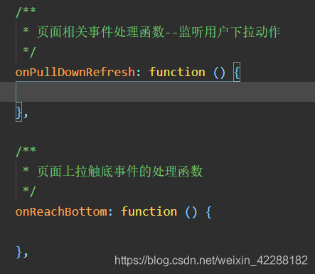
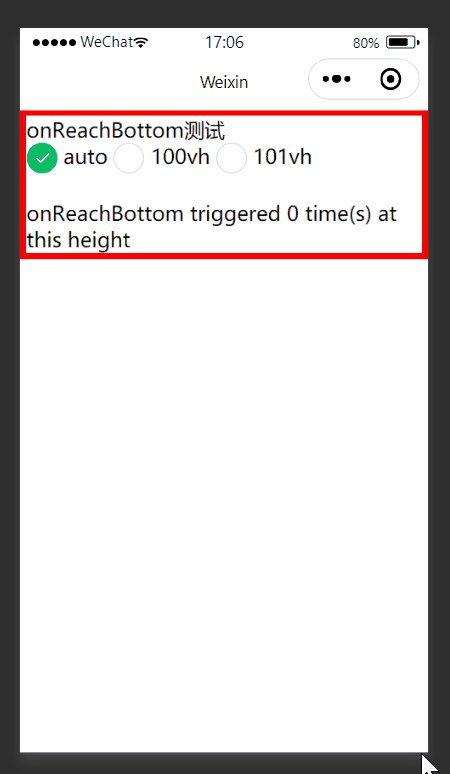
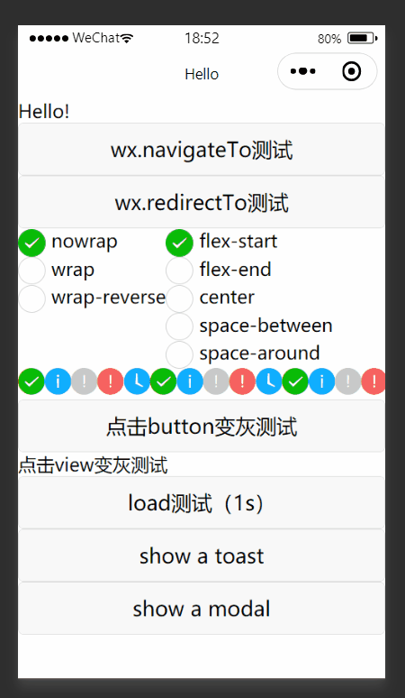
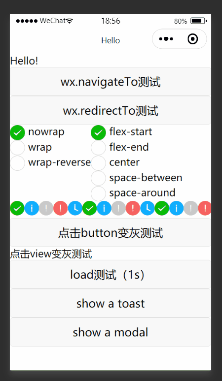

# 微信小程序无法触发onReachBottom的解决方案

最近写微信小程序的时候想用[onReachBottom](https://developers.weixin.qq.com/miniprogram/dev/reference/api/Page.html#onReachBottom)做个上拉刷新，写完以后却怎么都触发不了这个事件，所以到网上找了一圈解决方案，最终解决了。在这里总结一下。

## 情况1：index.js中onReachBottom函数重复

如果直接使用微信小程序模板，index.js中会自动生成onLoad等生命周期回调函数和onReachBottom等用户行为回调函数的空模板。如果忘了这回事，自己又写了一个同名函数，不会报错，但会自动使用同名函数中的第一个。

自动生成了一个

结果自己又写了一个

## 情况2：触发onReachBottom需要滚动条

在我的测试中，页面高度超过屏幕（出现滚动条）时才会触发onReachBottom事件。这倒也符合直觉，因为如果页面高度都没有超过屏幕，更新内容应该直接出现在屏幕剩下的部分，不需要上拉触发更新。但是文档里并没有相应的说明，所以暂且存疑。

如上图所示，通过选项调整红框内view的高度（即调整页面高度）。页面高度小于或等于屏幕高度时，一直失败，但只要页面高度稍微高于屏幕高度，就可以在上拉时触发onReachBottom事件。

（注：border的高度算在页面高度内，所以上图中100vh指view高度为98vh，上下border高度分别为1vh，101vh同理。）

代码demo见：

[https://github.com/zhanghuimeng/onReachBottomTest](https://github.com/zhanghuimeng/onReachBottomTest)

我当时做的页面高度不够，所以触发不了，增加高度后就好了；但并不是每次上拉都能触发，我很困惑，于是就到了下一个问题。

## 情况3：对事件的触发条件有误解

https://developers.weixin.qq.com/miniprogram/dev/reference/api/Page.html#onReachBottom

“在触发距离内滑动期间，本事件只会被触发一次”的意思是，上拉触发该事件一次后，如果页面没有回到触发距离以外（即滑回去足够距离），再怎么上拉都不会重新触发该事件，必须滑上去再滑下来才行。所以并不是任意滑动都能触发事件，这是正常的，并不是代码写错了。

一直向上滑，无法再触发事件

下滑后再上滑，可以触发事件

（不过我在网上并没有看到其他人对此产生误解，可能纯属我自己傻逼了。）